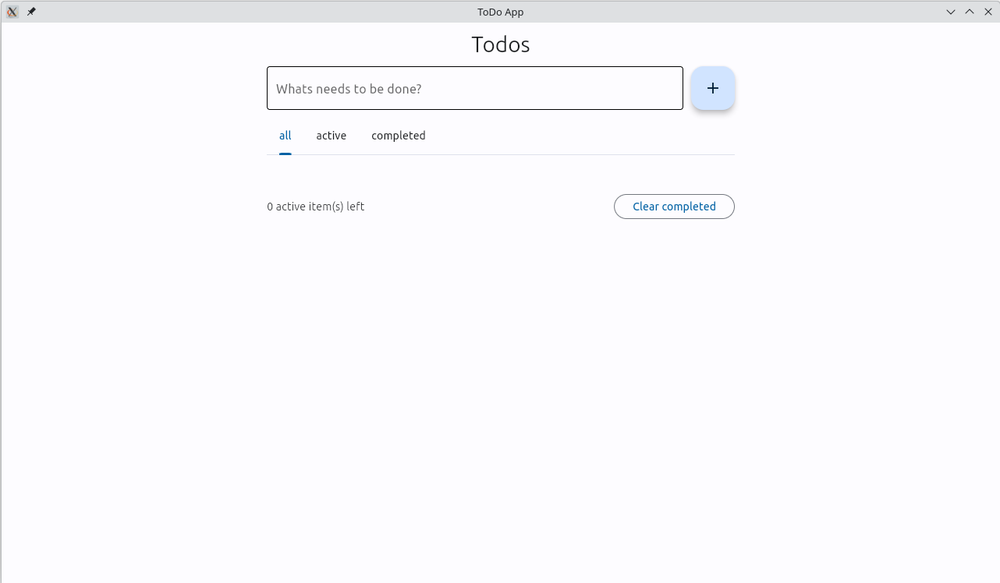
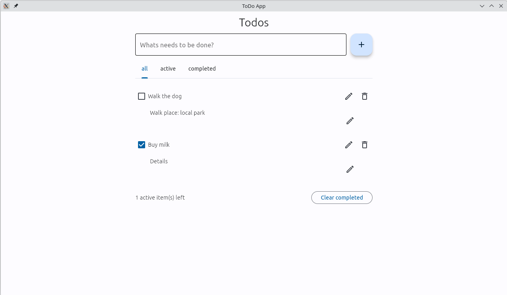
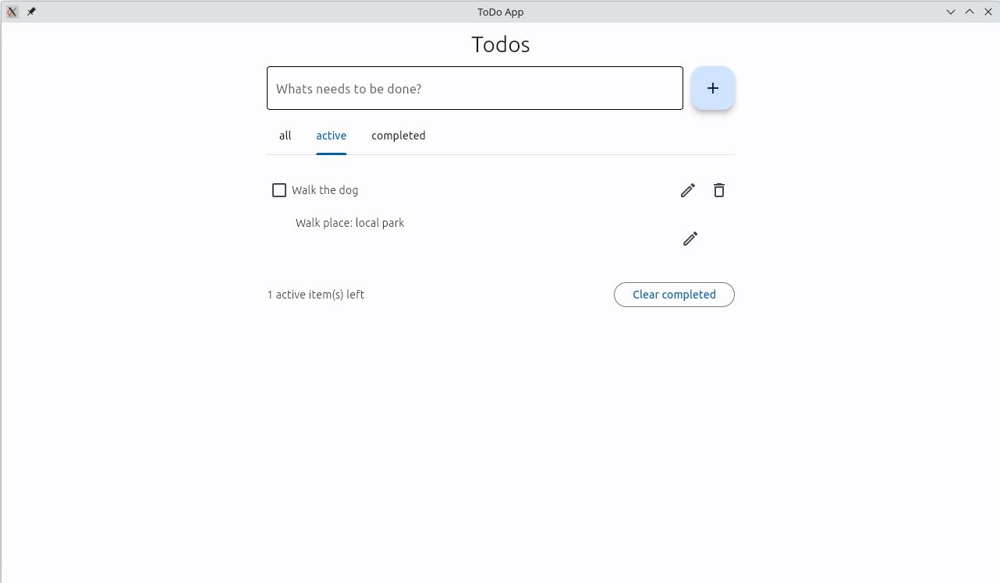
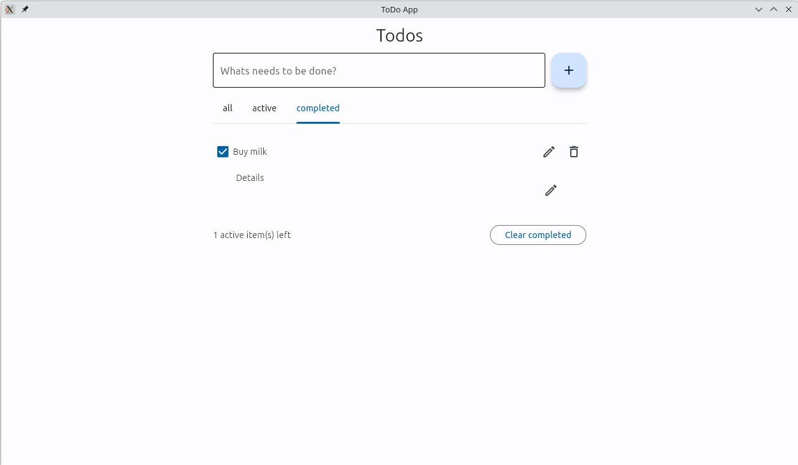

# flet-todo-list

## Summary

Simple todo-list project writtein in flutter-based framework Flet.

Application manages user-defined tasks, with possibility to add descriptio to each of them.
Tasks are stored in local database and are imported on restart.
There is also a function to clear all completed tasks, to avoid list cluttering.

This serves as an excercise in GUI application development and using related patterns (MVP)

## Screenshots

Main view of the application:



Added some tasks, with and without description (details):



View with only active tasks:



And with only completed tasks:



## Install

Python version: 3.10.16

1. Create and Activate virtual environment:

    ```bash
    python -m venv .venv
    ```

    On Linux:

    ```bash
    source .venv/bin/activate
    ```

    On Windows:

    ```bash
    source .venv/scripts/activate
    ```

2. Install the requirements:

    ```bash
    pip install -r requirements.txt
    ```

3. Run:

    ```bash
    python app.py
    ```
